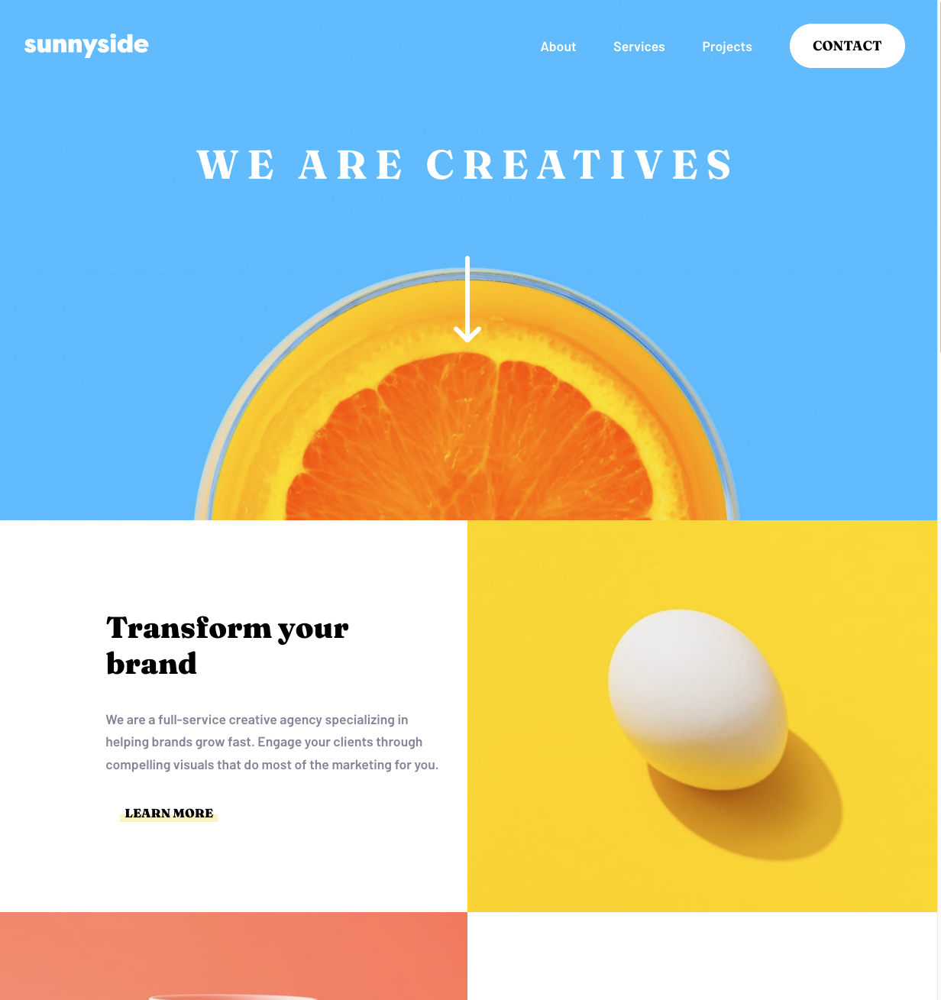

# Frontend Mentor - Sunnyside agency landing page solution

This is a solution to the [Sunnyside agency landing page challenge on Frontend Mentor](https://www.frontendmentor.io/challenges/sunnyside-agency-landing-page-7yVs3B6ef). Frontend Mentor challenges help you improve your coding skills by building realistic projects.

## Table of contents

- [Overview](#overview)
  - [The challenge](#the-challenge)
  - [Screenshot](#screenshot)
  - [Links](#links)
- [My process](#my-process)
  - [Built with](#built-with)
  - [What I learned](#what-i-learned)
  - [Continued development](#continued-development)
  - [Useful resources](#useful-resources)
- [Author](#author)

## Overview

### The challenge

Users should be able to:

- View the optimal layout for the site depending on their device's screen size
- See hover states for all interactive elements on the page

### Screenshot

### Links

- Solution URL: [Github repo](https://github.com/mrcordova/sunnyside-agency-landing-page)
- Live Site URL: [Github page](https://mrcordova.github.io/sunnyside-agency-landing-page/)

## My process

### Built with

- Semantic HTML5 markup
- CSS custom properties
- Flexbox
- CSS Grid
- Mobile-first workflow

### What I learned

I learn how to overlap grids and layers.

### Continued development

I will continue to learn how to use CSS grid.

### Useful resources

- [How to add an arrow to a box](https://jsfiddle.net/tbwn41wz/m) - This helped me understand how to use pseudoelement to add an arrow shape.

## Author

- Website - [Github](https://github.com/mrcordova?tab=repositories)
- Frontend Mentor - [@mrcordova](https://www.frontendmentor.io/profile/mrcordova)
